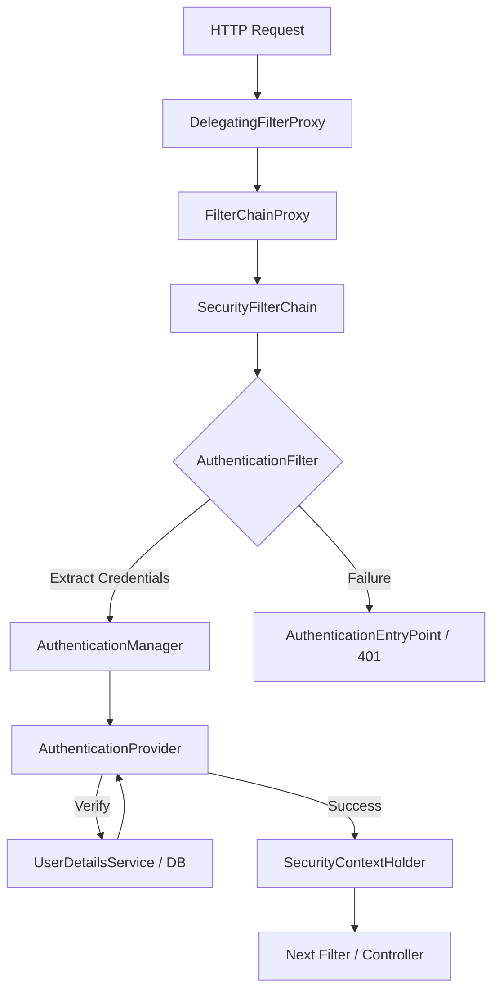

# Spring Security 6.x: The Definitive Master Guide (2026 Edition)

This guide is a comprehensive technical breakdown of the "Master Spring Security In One Shot" course. It is designed to serve as a complete replacement for the 4.5-hour video, providing architectural deep-dives, implementation steps, and production-ready code.

-----

## Table of Contents

1.  [Executive Summary: The "Why" of Spring Security](https://www.google.com/search?q=%23executive-summary)
2.  [Core Architecture & The Big Picture](https://www.google.com/search?q=%23core-architecture)
3.  [Section 1: Basic Authentication Implementation](https://www.google.com/search?q=%23section-1-basic-auth)
4.  [Section 2: Deep Dive into JWT (JSON Web Tokens)](https://www.google.com/search?q=%23section-2-jwt)
5.  [Section 3: Authorization & Role-Based Access Control (RBAC)](https://www.google.com/search?q=%23section-3-authorization)
6.  [Section 4: Method Level Security](https://www.google.com/search?q=%23section-4-method-security)
7.  [Section 5: User Management (JDBC & Custom)](https://www.google.com/search?q=%23section-5-user-management)
8.  [Section 6: OAuth2 & Social Login (Google)](https://www.google.com/search?q=%23section-6-oauth2)
9.  [Comparison Tables](https://www.google.com/search?q=%23comparison-tables)
10. [Troubleshooting & Pro-Tips](https://www.google.com/search?q=%23troubleshooting)

-----

\<a name="executive-summary"\>\</a\>

## Executive Summary: The "Why" of Spring Security

In modern application development, security is not a feature; it is a foundation. Spring Security 6.x provides a robust, highly customizable authentication and access-control framework.

**Key Objectives:**

  * **Protection:** Guarding against unauthorized access, CSRF, XSS, and Session Fixation.
  * **Standardization:** Implementing industry standards like OAuth2, OIDC, and JWT seamlessly.
  * **Decoupling:** Separating security logic from business logic using Servlet Filters and AOP.

-----

\<a name="core-architecture"\>\</a\>

## Core Architecture & The Big Picture

Spring Security operates as a series of **Servlet Filters**. Before a request hits your `@RestController`, it must survive the **Security Filter Chain**.

### The Architectural Flow (Mermaid Diagram)



### Key Components Defined:

  * **SecurityContextHolder:** The heart of Spring Security storage. It holds the `SecurityContext`, which contains the `Authentication` object of the currently logged-in user.
  * **AuthenticationManager:** The API that defines how Spring Security’s Filters perform authentication.
  * **AuthenticationProvider:** The engine that performs a specific type of authentication (e.g., `DaoAuthenticationProvider` for username/password).
  * **UserDetailsService:** A core interface used to retrieve user authentication and authorization information.

-----

\<a name="section-1-basic-auth"\>\</a\>

## Section 1: Basic Authentication Implementation

Basic Auth is the simplest way to secure an app by sending a Base64 encoded `username:password` string in the header.

### Step-by-Step Setup:

1.  **Add Starter:** Include `spring-boot-starter-security` in your `pom.xml`.
2.  **Define Configuration:** Create a `@Configuration` class.
3.  **Bean Creation:** Define a `SecurityFilterChain` bean.

### Production-Ready Config:

```java
@Configuration
@EnableWebSecurity
public class ProjectSecurityConfig {

    @Bean
    public SecurityFilterChain defaultSecurityFilterChain(HttpSecurity http) throws Exception {
        http.csrf(csrf -> csrf.disable())
            .authorizeHttpRequests(requests -> requests
                .requestMatchers("/myAccount", "/myBalance").authenticated()
                .requestMatchers("/notices", "/contact", "/register").permitAll())
            .formLogin(Customizer.withDefaults())
            .httpBasic(Customizer.withDefaults());
        return http.build();
    }
}
```

-----

\<a name="section-2-jwt"\>\</a\>

## Section 2: Deep Dive into JWT (JSON Web Tokens)

JWT is stateless. The server does not store session information; instead, the state is stored in the token itself.

### The JWT Lifecycle:

1.  **Login:** User provides credentials.
2.  **Token Generation:** Server validates credentials and generates a signed JWT using a Secret Key.
3.  **Client Storage:** Client stores the token (usually in LocalStorage).
4.  **Authorization:** Client sends the token in the `Authorization: Bearer <token>` header for every request.

### Implementation Logic:

You must implement a custom filter that extends `OncePerRequestFilter` to validate the token on every incoming request.

**Pro-Tip:** Never store sensitive data (like passwords) in the JWT payload/claims, as it is only Base64 encoded and can be easily decoded.

-----

\<a name="section-3-authorization"\>\</a\>

## Section 3: Authorization & Role-Based Access Control (RBAC)

Authorization happens *after* authentication. It determines if the "Principal" has the "Authority" to access a resource.

### Roles vs. Authorities:

  * **Authority:** A granular permission (e.g., `READ_PRIVILEGE`, `DELETE_PERMISSION`).
  * **Role:** A group of authorities prefixed with `ROLE_` (e.g., `ROLE_ADMIN`, `ROLE_USER`).

### Config Implementation:

```java
.requestMatchers("/admin/**").hasRole("ADMIN")
.requestMatchers("/user/**").hasAnyRole("USER", "ADMIN")
```

-----

\<a name="section-6-oauth2"\>\</a\>

## Section 6: OAuth2 & Social Login (Google)

OAuth2 allows your application to access resources on behalf of a user without seeing their password.

### Implementation Steps for Google Login:

1.  **GCP Setup:** Go to Google Cloud Console, create a project, and generate **OAuth 2.0 Client IDs**.
2.  **Redirect URI:** Set the authorized redirect URI to `http://localhost:8080/login/oauth2/code/google`.
3.  **Properties Config:**

<!-- end list -->

```properties
spring.security.oauth2.client.registration.google.client-id=YOUR_CLIENT_ID
spring.security.oauth2.client.registration.google.client-secret=YOUR_CLIENT_SECRET
```

4.  **Dependency:** Add `spring-boot-starter-oauth2-client`.

-----

\<a name="comparison-tables"\>\</a\>

## Comparison Tables

| Feature | Basic Authentication | JWT Authentication | OAuth2 |
| :--- | :--- | :--- | :--- |
| **State** | Stateful (Session-based) | Stateless | Usually Stateless |
| **Storage** | Server Memory (Session) | Client Side | Token-based |
| **Scalability** | Low (Session sticking needed) | High (Ideal for Microservices) | High |
| **Security** | Low (Credentials in every request) | Medium/High | Very High |

-----

\<a name="troubleshooting"\>\</a\>

## Troubleshooting & Pro-Tips

  * **403 Forbidden:** Often caused by CSRF being enabled by default. For non-browser clients (Postman/Mobile), you may need to disable it or provide a CSRF token.
  * **Password Encoding:** **Never** store plain text passwords. Use `BCryptPasswordEncoder`.
    ```java
    @Bean
    public PasswordEncoder passwordEncoder() {
        return new BCryptPasswordEncoder();
    }
    ```
  * **SecurityContext Empty:** Ensure your JWT filter is added **before** the `UsernamePasswordAuthenticationFilter`.
    ```java
    http.addFilterBefore(new JWTTokenValidatorFilter(), UsernamePasswordAuthenticationFilter.class);
    ```

**Final Note:** Spring Security 6.x has moved away from the `WebSecurityConfigurerAdapter` (deprecated). Always use the **Component-based configuration** (defining `Bean` of `SecurityFilterChain`) as shown in the examples above.
